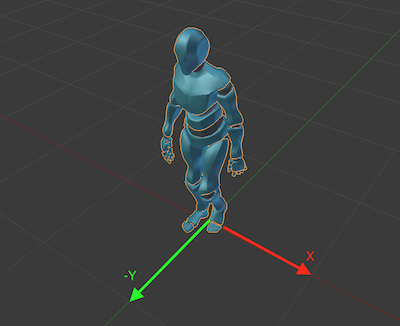
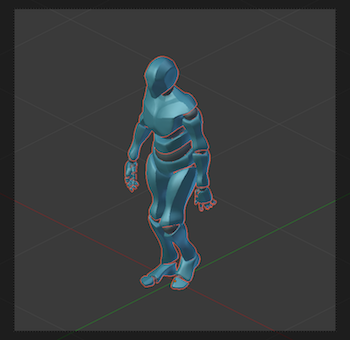
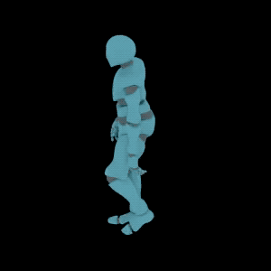

# Spray

## Sprite tools for Blender

### How to use

1. Import the target object to scene and set it location to `0,0,0`. The front side of object should be turned to the direction of negative Y axis, like on image below.

2. **IMPORTANT!** Set the correct frame range (start and end fields). Set start and end frame to 1 in case of target object doesn't have animation.
3. Go to `3D View > Tools Panel > Spray` and press `Add Isometric Camera` button.
4. Set sprite resolution.
5. Fill the `Target` field with correct name of target object (it's case sensitive) and press `Align To Target` button (it will be available after filling the `Target` field).
6. Switch to camera view (Numpad 0). The camera should be align and fit to the target object for all frame and directions. Use `Height` and `Orthographic Scale` in case of incorrect alignment.

7. Set light for target object or set `Environment Lighting` in `World` properties for object.
8. Set prefix for sprite names. Sprite will be named by mask: `{prefix}_{direction}_{frame}.png`, example: `dummy_sw_15.png`.
9. Select output path and press `Render Sprites` button.
10. **Profit!** (Don't be afraid of black background in the gif below. Sprite background is transparent by default.)

### TODO:
- [ ] Update for Blender 2.8 compatibility
- [ ] Save sprites to sprite sheet
